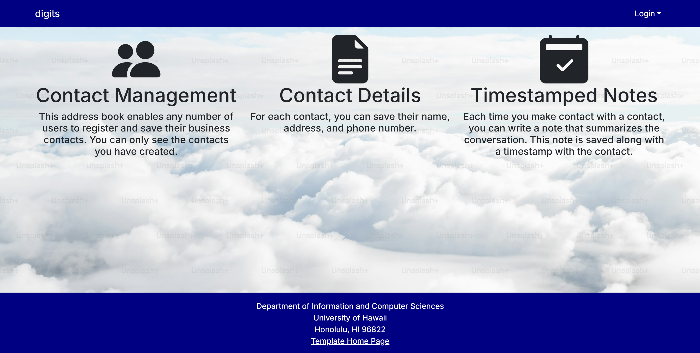
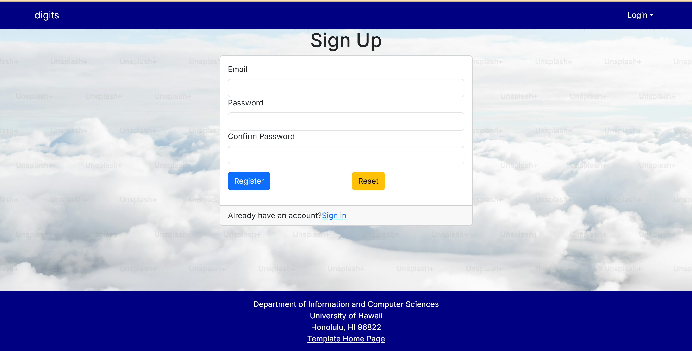
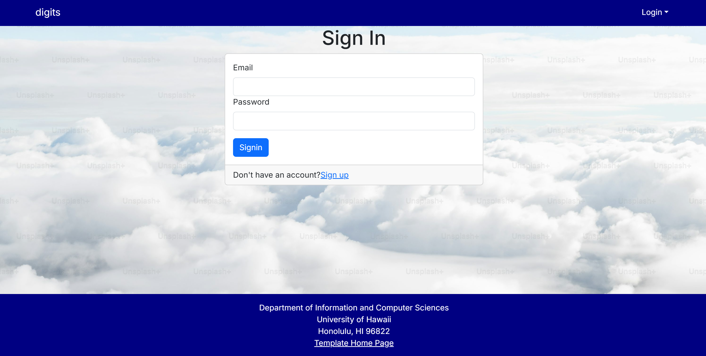
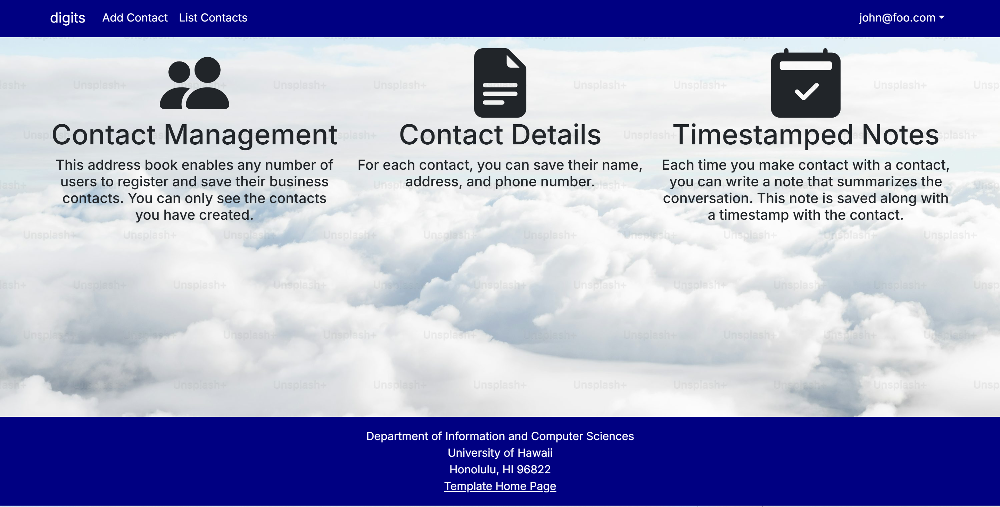
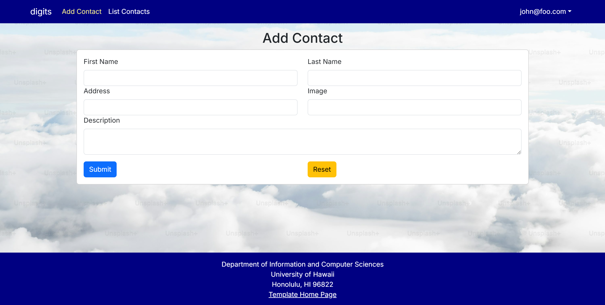
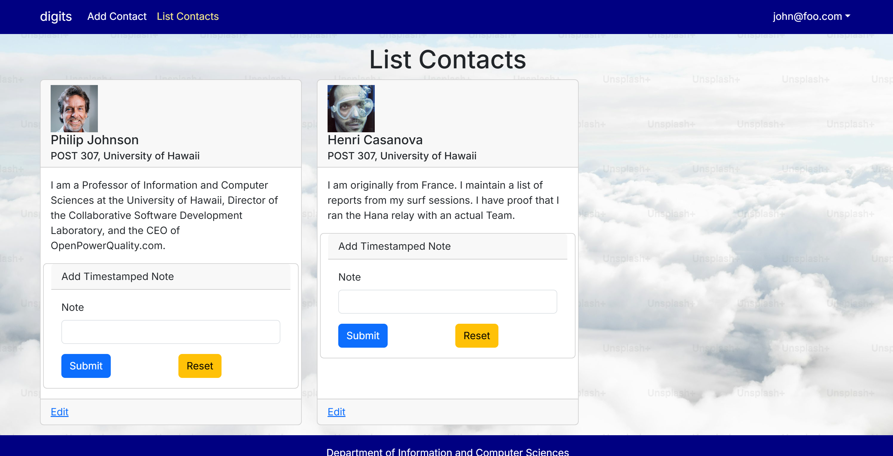
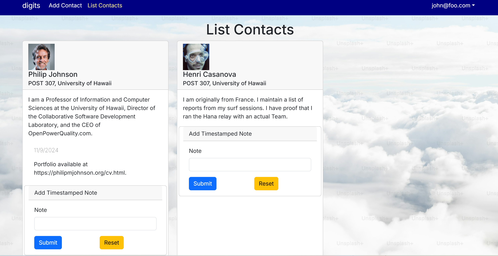
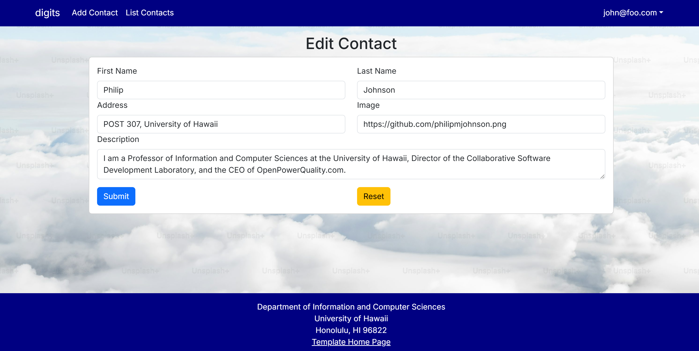
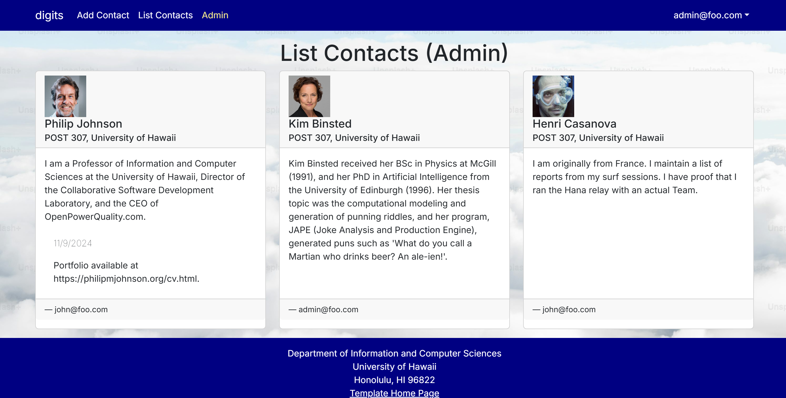

# digits



The "digits" web application is a utility for managing a list of contacts and adding timestamped notes per contact.

## Installation

First [download the digits application](https://github.com/jaked332/digits/tree/main) from GitHub. Note that the repository is private, and you should have permission from the author to access it.

Next, [install Next.js](https://nextjs.org/docs/app/getting-started/installation) and [PostgreSQL](https://www.postgresql.org/download/). 

Execute the following command to create a database for your application:

```
$ createdb <dbname>
Password:
$
```

Now, navigate (`cd`) into the directory of your local `digits` copy, and install third-party libraries with:

```
$ npm install
```

Then, use `sample.env` as a template for the `.env` file. Ensure that you use the same database name in the configuration, i.e., `DATABASE_URL="postgresql://<user>:<password>@localhost:5432/<dbname>?schema=public"`. Then run the Prisma migration `npx prisma migrate dev` to set up the PostgreSQL tables.

```
$ npx prisma migrate dev
```

Next, seed the database with the `/config/settings.development.json` data using `npx prisma db seed`.

```
$ npx prisma db seed
Environment variables loaded from .env
Running seed command `ts-node --compiler-options {"module":"CommonJS"} prisma/seed.ts` ...
Seeding the database
  Creating user: admin@foo.com with role: ADMIN
  Creating user: john@foo.com with role: USER
  Adding contact: Philip Johnson
  Adding contact: Henri Casanova
  Adding contact: Kim Binsted

The seed command has been executed.
$
```

## Running the System

Once the libraries are installed and the database is seeded, you can run the application by invoking the "dev" script in the `package.json` file:

```
$ npm run dev

> nextjs-application-template-1@0.1.0 dev
> next dev

  ▲ Next.js 14.2.10
  - Local:        http://localhost:3000
  - Environments: .env

 ✓ Starting...
 ✓ Ready in 13.4s
 ○ Compiling / ...
 ✓ Compiled / in 10.9s (7064 modules)
```

### Viewing the Running App

The `digits` application will appear at [http://localhost:3000](http://localhost:3000). You can login using the credentials in `settings.development.json`, or register a new account.

### ESLint for Static Analysis

You can verify that the code obeys our coding standards by running ESLint over the code in the src/ directory with:

```
$ npm run lint
```

## UI Walkthrough

The following sections describe the major features of `digits`.

### Landing Page

As soon as you navigate to the running application, you will reach the landing page which offers an overview of the `digits` web application:


### Sign-Up Page

While you can use the default user credentials, `admin@foo.com` or `john@foo.com`, you may create a new user by navigating to the `/auth/signup` route:



### Sign-In Page

Once the user is established, you may navigate to the sign-in page (`/auth/signin`):



### User Homepage

Once you are signed in, you may navigate to the home page. Note that you can now see additional navigation items on the NavBar, allowing access to pages for creating new contacts and listing existing contacts.



### Add Contact Page

You may click on "Add Contact" from the navigation bar. This page has a form that allows you to add a new contact into the user's contact list.



### List Contacts

#### Viewing

Click on "List Contacts" to view all contacts for the current user:



#### Timestamped Notes

An important feature of this page is the ability to add notes per contact:



### Edit Page

To edit any fields related to a contact, you can click the "Edit" link on the card. This will open up a form with pre-filled data, defaulting to the latest data in the database:



### Admin Mode

It is possible to designate admin users in the `settings.development.json` file. Admin users have access to a priviliged "Admin" page that lists all contacts of all users in the database:



To learn more about the code structure, check out the [base template on GitHub](https://github.com/ics-software-engineering/nextjs-application-template).
